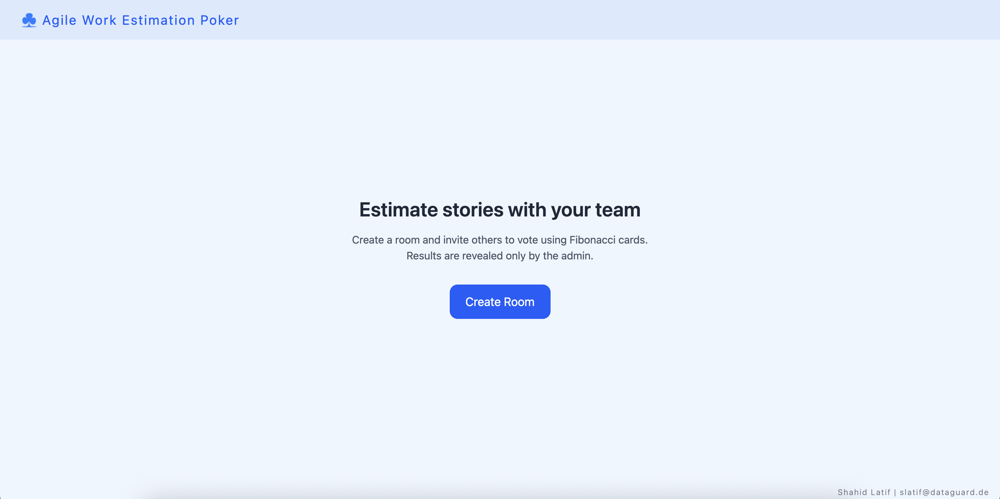

# Planning Poker

A real-time planning poker application for agile teams to estimate work items efficiently. Built with Vue.js, Nuxt.js, Socket.IO, and Node.js.



## Features

- 🎯 Real-time voting synchronization
- 👥 Multiple participants per room
- 🔒 Admin controls for revealing votes
- 📊 Vote statistics and analysis
- 🎨 Clean, modern UI with Tailwind CSS
- 📱 Responsive design for all devices

## Project Structure

- `web/` - Frontend application built with Nuxt 3
- `server/` - Backend server using Socket.IO
- `docker-compose.yml` - Docker configuration for local development
- `render.yaml` - Deployment configuration for Render

## Quick Start

1. Clone the repository:

   ```bash
   git clone https://github.com/yourusername/planning-poker.git
   cd planning-poker
   ```

2. Start the development environment:

   ```bash
   docker-compose up
   ```

   Or run each service separately:

   ```bash
   # Terminal 1 - Start the server
   cd server
   npm install
   npm run dev

   # Terminal 2 - Start the web app
   cd web
   npm install
   npm run dev
   ```

3. Open [http://localhost:3000](http://localhost:3000) in your browser

## Development

See individual README files in the `web/` and `server/` directories for specific development instructions.

## Deployment

The application is configured for deployment on Render using the `render.yaml` configuration file.

## License

ISC License
